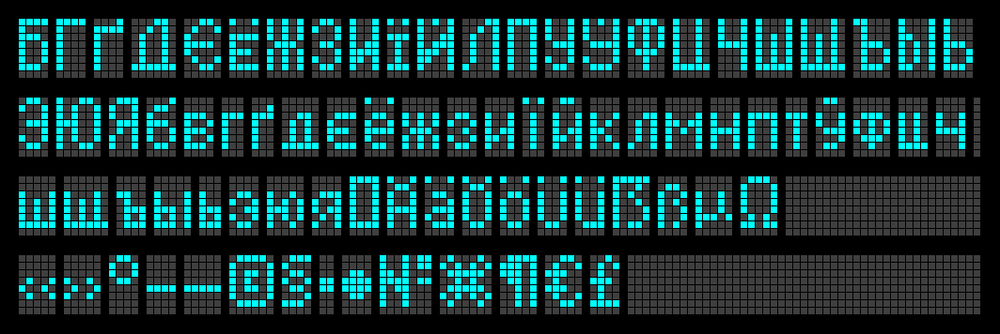

Matchbox
========

I have a silly stupid dream: to make some tiny yet functional text 
reading device with SSD1306 display module and a small MCU board, 
probably ESP32-C3 SuperMini or RP2040-Zero.

It must fit into a matchbox.

The font
--------

The most important part of this project is the font.

