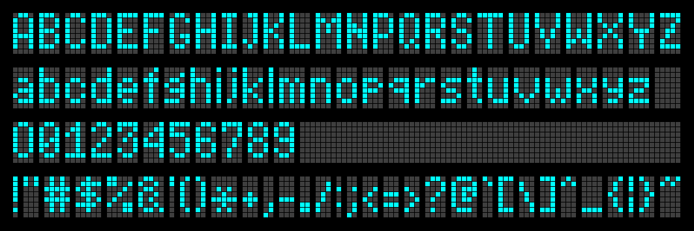
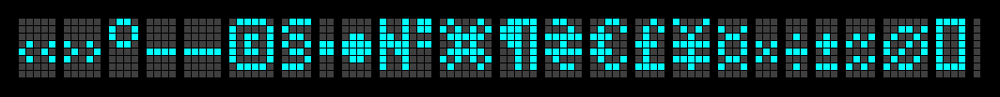
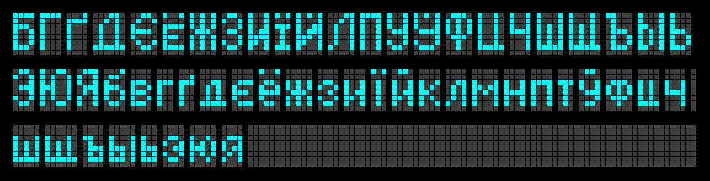
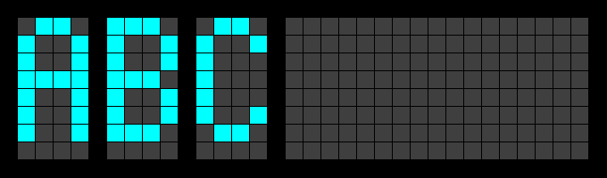

Matchbox
========

I have a silly stupid dream: to make some tiny yet functional text 
reading device with SSD1306 display module and a small MCU board, 
probably ESP32-C3 SuperMini or RP2040-Zero.

It must fit into a matchbox.


The font
--------

The most important part of this project is the font.

There already are trillion zillion ready-to-use small raster fonts
around to fulfill any sick need. Didn't I say this project is silly?








The font tool
-------------

I made this font using Gimp and my `tool` script. It can convert glyph
drawings to font in JSON format and vice versa.

How to use it:

 1. Create template file(s):
    ```
    $ ./tool -new test
    Creating new template test.json
    ```
 2. Generate font images from template files:
    ```
    $ ./tool -write test
    Reading template file test.json
    Writing font image test.png
    ```
 3. Edit the image `test.png`
    - draw some glyphs
    - mark gaps between glyphs
    
 4. Edit template file `test.json`, set glyph lines you made
 5. Convert font images to the actual font:
    ```
    $ ./tool --font test-font.json -read test.json
    Reading template file test.json
    Reading font image test.png
    Writing font file test-font.json
    ```
    This command can collect glyphs from different files and put it all
    together to one `font.json` file.
 6. You can edit template file `test.json` (change geomerty, colors,
    reorder glyphs, etc) and re-draw the image:
    ```
    $ ./tool --font test-font.json -w test
    Reading template file test.json
    Writing font image test.png
    ```
 7. You can test the font rendering:
    ```
    $ ./tool --font test-font.json -test AAA
      ####      ####      ####
    ##    ##  ##    ##  ##    ##
    ##    ##  ##    ##  ##    ##
    ########  ########  ########
    ##    ##  ##    ##  ##    ##
    ##    ##  ##    ##  ##    ##
    ##    ##  ##    ##  ##    ##
    ```
