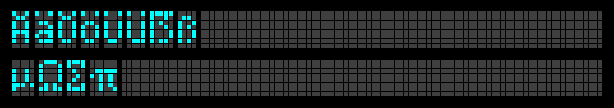

The font
========

The font is defined in these images (plus metadata in JSON format).


English and Ukrainian are fully supported. Some other languages ​​may 
be partially supported, as well as a certain number of punctuation and 
mathematical symbols.





The font tool
-------------

I made this font using Gimp and my `tool` script. It can convert glyph
drawings to font in JSON format and vice versa.

How to use it:

 1. Create metadata file(s):
    ```
    $ ./tool -new test
    Creating new metadata file test.json
    ```
 2. Generate font image from metadata file:
    ```
    $ ./tool -write test
    Reading metadata file test.json
    Writing font image test.png
    ```
 3. Edit the image `test.png`
    - draw some glyphs
    - mark gaps between glyphs
    
 4. Edit metadata file `test.json`, set glyph lines you made
 5. Convert font images to the actual font:
    ```
    $ ./tool --font test-font.json -read test.json
    Reading metadata file test.json
    Reading font image test.png
    Writing font file test-font.json
    ```
    This command can collect glyphs from different files and put it all
    together to one `font.json` file.
 6. You can edit metadata file `test.json` (change geomerty, colors,
    reorder glyphs, etc) and re-draw the image:
    ```
    $ ./tool --font test-font.json -w test
    Reading metadata file test.json
    Writing font image test.png
    ```
 7. You can test the font rendering:
    ```
    $ ./tool --font test-font.json -test AAA
      ####      ####      ####
    ##    ##  ##    ##  ##    ##
    ##    ##  ##    ##  ##    ##
    ########  ########  ########
    ##    ##  ##    ##  ##    ##
    ##    ##  ##    ##  ##    ##
    ##    ##  ##    ##  ##    ##
    ```
